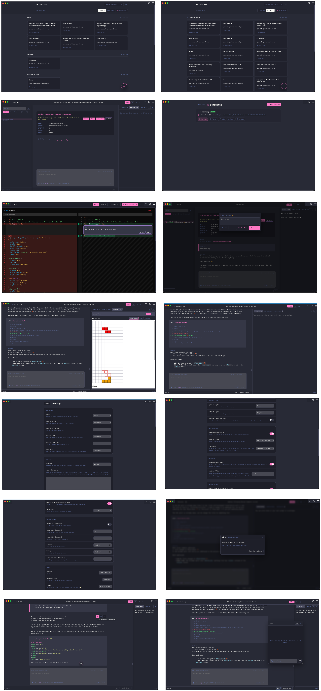

<h1 align="center">pi-web (Remote Control Your Pi)</h1>

<div align="center">

[](https://github.com/ygncode/pi-web/stargazers)
[](https://www.npmjs.com/package/@ygncode/pi-web)
[](LICENSE)
[](https://t.me/+NJvFOTTa0wNjNTc9)


</div>

<div align="center">

Drive your [pi](https://pi.dev) sessions or installed [Codex CLI](https://developers.openai.com/codex/cli/) threads from your phone, tablet, or laptop — anywhere on your network, or remotely over Tailscale.

It's a full PWA, so you can install it and use it like a native app on any device. Think of it as your own personal AI workspace — like Claude's Cowork, but with different models — chat across models, code from your phone, or turn it into a [personal assistant](user-docs/en/personal-assistant.md) that lives on your machine.

Make it yours: switch themes and fonts, and turn off anything you do not need in settings. More features are on the way, but pi-web will not get bloated.

</div>

> [!WARNING]
> pi-web is currently in **beta**. Things will change and break!

> [!TIP]
> New here? **[Read the user guide →](user-docs/en/README.md)** for a full tour of features, install steps, and tips.

## Screenshots

<div align="center">
  <br />
  <em>Desktop</em>
  <br /><br />
  <br />
  <em>Mobile</em>
</div>

## How It Fits Together

```
 Pi / Codex CLI               Browser (phone / tablet / laptop)
      │                                │
      │ native state                   │ HTTP + SSE
      ▼                                ▼
 Pi JSONL / ~/.codex  ←──────  pi-web (Go HTTP server)
                                      │
                    ┌─────────────────┼──────────────────┐
                    │                 │                  │
             runtime workers      projections      tailscale serve
       (pi RPC / Codex app-server) (live reload)    (remote HTTPS)
```

- **Pi** owns append-only JSONL transcripts under `~/.pi/agent/sessions/`.
- **Codex** remains authoritative under `~/.codex`; pi-web uses the installed CLI and atomically builds disposable `codex-<thread>.jsonl` projections for the common viewer/export path.
- One binary runs `-runtime=pi|codex|both` (default `pi`). Active sessions get one reusable `pi --mode rpc` or `codex app-server --stdio` worker, reaped after 10 minutes idle.
- **fsnotify + SSE** propagate transcript/projection and status changes to browsers.
- **Tailscale Serve** publishes the localhost server as an HTTPS endpoint on your tailnet.

## Install

```bash
pi install npm:@ygncode/pi-web@beta
```

That's it — it downloads the matching binary, sets up auto‑start, and registers the `/web`, `/pi-web`, `/remote`, and `/refresh` commands.

Once installed, open `http://127.0.0.1:31415` in your browser. From pi, use `/web` to open the current session in your browser instantly. If Tailscale is running on your machine, pi-web automatically publishes an HTTPS endpoint on your tailnet — use `/remote` from pi to get a QR code and URL for any device on your tailnet.

For manual installs, binary downloads, building from source, or enabling Codex/both mode, see [user-docs/install.md](user-docs/en/install.md).

### Enable Codex (optional)

Install and sign in with the Codex CLI first, then start the same binary in Codex or dual-runtime mode:

```bash
pi-web -runtime=codex
pi-web -runtime=both
PI_WEB_CODEX_COMMAND=/absolute/path/to/codex pi-web -runtime=both
```

`-codex-command` and `PI_WEB_CODEX_COMMAND` are executable paths. pi-web preserves `HOME` so Codex uses its normal authentication; it never reads `~/.codex/auth.json`. **Codex sessions run in YOLO mode** (`approvalPolicy: never` plus `danger-full-access`), equivalent to `codex --yolo`: model-generated commands can access the whole host filesystem and network without confirmation. In `both` mode, Pi continues to work if Codex is temporarily unavailable, and existing Codex projections remain viewable/exportable. Generated auto-start entries omit `-runtime`, so add the desired runtime flag to the service command to make Codex mode persistent.

## Pi Integration

After `pi install npm:@ygncode/pi-web@beta`, you get:

| Command | What it does |
|---------|--------------|
| `/web` | Open the current session in your browser (SSH-aware: skips browser and shows URL only) |
| `/pi-web` | Show status, version, start/stop/restart the server, or update |
| `/remote` | Show a QR code and URL for remote access over Tailscale |
| `/refresh` | Pull new messages written from remote browsers back into the terminal session |

Session **auto-titling** is built into pi-web itself and configured on the `/settings` page. It's **on by default** and names sessions automatically. You can choose:

- **When to title** — once per session, or on every new message (the default).
- **Title model** — a free, instant **built-in word heuristic (no AI)** by default, or pick a model (e.g. a small/fast one) for smarter, model-written titles.

The package also installs the pi-web binary to `~/.pi/agent/bin/pi-web` and sets up auto-start on login.

## Auto-Start on Login

The `pi install npm:@ygncode/pi-web@beta` command sets this up automatically:

| OS | Mechanism |
|----|-----------|
| macOS | launchd plist at `~/Library/LaunchAgents/com.pi-web.plist` |
| Linux | systemd user service at `~/.config/systemd/user/pi-web.service` |
| Windows | `HKCU` Run-key entry launching a hidden starter in `~/.config/pi-web/` |

To set a token for remote access, create `~/.config/pi-web/env`:

```
PI_WEB_TOKEN=your-token-here
```

For more details (manual setup, custom ports, non-loopback binds), see [user-docs/install.md](user-docs/en/install.md).

## Development

```bash
make setup   # install frontend deps and download Go modules
make check   # frontend test/build + Go test/vet
make build   # setup if needed, build frontend, then build ./pi-web

# exercise the built binary with an installed Codex CLI
./pi-web -runtime=both
```

